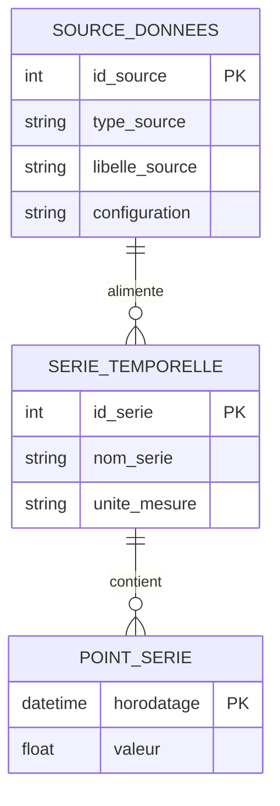

# MCD 2 — Source de données du moteur temporel

Modélise l'exigence : le moteur temporel doit rester indépendant de la provenance
des données (JSON simulé aujourd'hui, base de données ou service externe demain),
sans réécriture du moteur.

Principe : le moteur ne manipule jamais `source_donnees` directement — il ne lit
que `serie_temporelle` / `point_serie`. `source_donnees` porte seule la connaissance
du type de provenance (`type_source`), ce qui permet d'ajouter un nouveau provider
(BDD, API, ...) en créant une nouvelle occurrence de `source_donnees` sans toucher
à la structure de `serie_temporelle` / `point_serie` ni au moteur.

## Diagramme (Mermaid)



## Notation Merise (fidèle au style de mcd.loo — à reproduire dans Looping)

```
┌────────────────────────┐
│    source_donnees      │
├─────────────────────────┤
│ id_source               │  (clé, soulignée)
│ type_source              │  ex: "json", "bdd", "api"
│ libelle_source            │
│ configuration              │  ex: chemin fichier / chaîne de connexion
└─────────────────────────┘
            │
          (1,n)
            │
        ⬭ alimente ⬭
            │
          (1,1)
            │
┌────────────────────────┐
│    serie_temporelle    │
├─────────────────────────┤
│ id_serie                │  (clé, soulignée)
│ nom_serie                 │
│ unite_mesure               │
└─────────────────────────┘
            │
          (1,1)
            │
        ⬭  contient ⬭
            │
          (0,n)
            │
┌────────────────────────┐
│      point_serie       │
├─────────────────────────┤
│ horodatage               │  (clé, soulignée)
│ valeur                    │
└─────────────────────────┘
```

### Lecture des cardinalités

- `source_donnees (1,n) — alimente — serie_temporelle (1,1)`
  Une source alimente une ou plusieurs séries ; chaque série provient d'une seule source.
- `serie_temporelle (1,1) — contient — point_serie (0,n)`
  Une série contient zéro à n points ; chaque point appartient à une seule série.

## Correspondance avec les sous-tâches

| Sous-tâche | Élément du MCD |
|---|---|
| Définir l'interface/source de données | Entité `source_donnees` (le moteur n'en connaît que la forme conceptuelle, pas l'implémentation) |
| Créer le provider JSON | Une occurrence de `source_donnees` avec `type_source = "json"` |
| Faire dépendre le moteur de l'interface | Le moteur ne lit/écrit que `serie_temporelle` et `point_serie` |
| Vérifier que le moteur ne lit pas directement le JSON | Aucune association directe moteur ↔ `source_donnees.configuration` dans le modèle : ce champ n'est consommé que par le provider |
