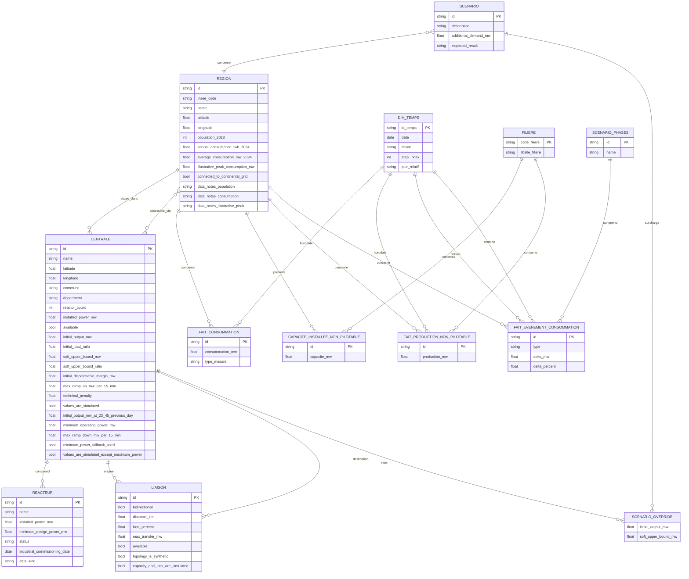

# MCD 2 — Modèle destiné à se substituer aux fichiers JSON du moteur temporel

## Contenu des fichiers JSON (vérifié)

| Fichier | Contenu | Rôle dans ce MCD |
|---|---|---|
| `data.json` — `metadata` | description du dataset, sources, avertissements | non modélisé (documentation, pas une donnée opérationnelle) |
| `data.json` — `simulation_parameters` | poids/règles de l'algorithme d'allocation | non modélisé (configuration globale, pas une entité) |
| `data.json` — `plants[]` (18) | centrales, avec `location{}`, `reactors[]`, `simulation{}` | `centrale` + `reacteur` |
| `data.json` — `regions[]` (13) | régions, avec `centroid{}`, `local_plant_ids[]`, `external_entry_plant_ids[]` | `region` |
| `data.json` — `plant_edges[]` (33) | liaisons entre deux centrales | `liaison` |
| `data.json` — `example_scenarios[]` (4) | scénarios de démonstration, `plant_overrides{}` | `scenario` + `scenario_override` |
| `energia_parametres_temporels_nucleaire.json` | `plants[]` reprend les mêmes 18 `plant_id` | **enrichit** `centrale` (5 nouvelles colonnes) ; `global_nuclear_reserve` non modélisé (configuration) |
| `energia-journee-reference-consommation.json` | `region.consumption_mw` = 96 valeurs (pas de 15 min) | nouvelle table de faits `consommation_reference` |
| `energia-journee-reference-avec-t-moins-1.json` | même profil + `initial_state_t_minus_1` | même table + nouvelle table `etat_initial_regional` |
| `energia-production-non-pilotable.json` | `region.production_mw{solar,wind}` = 96 × 2 filières | nouvelle table de faits `production_non_pilotable` + `capacite_installee_non_pilotable` |
| `energia-scenarios-phase3-exemples.json` | `scenarios[].events[]` (type, région, fenêtre horaire, delta) | nouvelles tables `scenario_phase3` + `evenement_consommation` |

Aucun de ces fichiers n'ajoute de colonne à `region` autrement qu'au travers
d'une nouvelle table liée (`region` reste l'entité de rattachement commune à
`data.json` et aux 4 autres fichiers — c'est elle qui fait tenir le modèle en un
seul MCD).

## Cible : consolidation en modèle en étoile

Constat du MCD ci-dessus : `consommation_reference`, `etat_initial_regional` et
`production_non_pilotable` sont trois tables de faits quasi identiques (une
mesure numérique + FK région + FK horodatage), nées du fait qu'elles viennent
de 3 fichiers JSON différents plutôt que d'une différence de nature. Et
`pas_de_temps.horodatage` ne stocke que `HH:MM` : les JSON sources décrivent
une seule journée de référence synthétique (`metadata.reference_date`, jamais
persisté), donc la BDD ne sait pas dater ses lignes.

Cible retenue :

- **`pas_de_temps` devient `dim_temps`**, enrichie d'une vraie `date` (et
  garde `step_index`) — pour que la BDD puisse un jour porter plusieurs
  journées sans changer de schéma, même si l'ingestion n'écrit qu'une seule
  date pour l'instant. `jour_relatif` (J / J-1), qui était une colonne de
  `etat_initial_regional`, migre ici : c'est une propriété du pas de temps,
  pas de la région.
- **`consommation_reference` et `etat_initial_regional` fusionnent en une
  seule table de faits `fait_consommation`**, même grain (région × temps),
  distinguées par une colonne `type_mesure` (`reference` / `initial_t_moins_1`)
  au lieu de deux tables séparées qu'il faut `UNION` pour les requêter
  ensemble.
- **`production_non_pilotable` devient `fait_production_non_pilotable`** —
  inchangée dans sa forme (région × filière × temps), c'est déjà le grain
  attendu d'une table de faits ; seul le renommage l'aligne sur les deux
  autres.
- **`capacite_installee_non_pilotable` ne devient pas une table de faits** :
  c'est une capacité installée (photo statique par région/filière), pas une
  série temporelle — pas de FK vers `dim_temps`, elle reste ce qu'elle est
  déjà.
- **`evenement_consommation` gagne deux FK vers `dim_temps`** (`debute` /
  `termine`) à la place de `start_`/`end_` en `VARCHAR` libre, pour que ses
  bornes soient des pas de temps réels comme le reste du modèle plutôt que du
  texte non contraint.

Le graphe du parc (`centrale`, `reacteur`, `liaison`, `scenario`,
`scenario_override`) ne change pas : ce sont des entités de référence, pas des
séries temporelles, elles n'ont rien à gagner à devenir des faits.

## Table des associations (cible)

| Association | Entité A | Card. A | Card. B | Entité B | Origine JSON |
|---|---|---|---|---|---|
| situee_dans | region | (0,n) | (1,1) | centrale | `location.region_id` / `region.local_plant_ids` |
| accessible_via | region | (0,n) | (0,n) | centrale | `region.external_entry_plant_ids` |
| comprend | centrale | (0,n) | (1,1) | reacteur | `plants[].reactors[]` |
| origine | centrale | (0,n) | (1,1) | liaison | `plant_edges[].from` |
| destination | centrale | (0,n) | (1,1) | liaison | `plant_edges[].to` |
| concerne | scenario | (1,1) | (0,n) | region | `example_scenarios[].region_id` |
| surcharge | scenario | (0,n) | (1,1) | scenario_override | `example_scenarios[].plant_overrides` |
| cible | centrale | (0,n) | (1,1) | scenario_override | clé de `plant_overrides{plant_id: ...}` |
| concerne | region | (0,n) | (1,1) | fait_consommation | `regions[].consumption_mw` + `initial_state_t_minus_1.regions`, fusionnés (discriminant `type_mesure`) |
| horodate | dim_temps | (0,n) | (1,1) | fait_consommation | `timestamps[]` |
| possede | region | (0,n) | (1,1) | capacite_installee_non_pilotable | `regions[].synthetic_installed_capacity_mw` |
| concerne | filiere | (0,n) | (1,1) | capacite_installee_non_pilotable | clé `solar`/`wind` |
| concerne | region | (0,n) | (1,1) | fait_production_non_pilotable | `regions[].production_mw` |
| concerne | filiere | (0,n) | (1,1) | fait_production_non_pilotable | clé `solar`/`wind` |
| horodate | dim_temps | (0,n) | (1,1) | fait_production_non_pilotable | `timestamps[]` |
| comprend | scenario_phase3 | (0,n) | (1,1) | fait_evenement_consommation | `scenarios[].events[]` |
| concerne | region | (0,n) | (1,1) | fait_evenement_consommation | `events[].region_id` |
| debute | dim_temps | (0,n) | (1,1) | fait_evenement_consommation | `events[].window_start` |
| termine | dim_temps | (0,n) | (1,1) | fait_evenement_consommation | `events[].window_end` |

## Vue Mermaid — cible

Ce diagramme ne contient que des entités ayant une clé et au moins une
association : `simulation_parameters` (data.json) et le bloc de configuration
du fichier nucléaire temporel restent hors MCD (voir plus haut) — pas de bloc
flottant.

## Notes de lecture

- `situee_dans` et `accessible_via` sont deux associations **distinctes** entre
  `region` et `centrale` : la première pour `local_plant_ids` (rattachement
  territorial, la centrale a exactement 1 région), la seconde pour
  `external_entry_plant_ids` (accès de secours, many-to-many).
- `liaison`, `scenario_override`, `fait_consommation` et
  `fait_production_non_pilotable` sont chacune une entité à part entière
  reliée par **deux associations** (voire trois pour
  `fait_production_non_pilotable` : région, filière, temps ; quatre pour
  `fait_evenement_consommation` : région, scénario phase 3, début, fin) —
  jamais une colonne ajoutée à une ligne existante. C'est le même principe
  partout dans ce document.
- `fait_consommation` remplace les anciennes `consommation_reference` et
  `etat_initial_regional` (même grain région × temps, `type_mesure` comme
  discriminant) ; `dim_temps` remplace `pas_de_temps` en y ajoutant `date` et
  `jour_relatif` — voir « Cible : consolidation en modèle en étoile » plus
  haut pour le raisonnement complet.
- `region` est le point de jonction entre `data.json` (parc nucléaire, graphe)
  et les 4 autres fichiers (séries temporelles, scénarios phase 3) : c'est elle
  qui permet de n'avoir qu'un seul MCD au lieu de deux schémas disjoints.
- `metadata`, `simulation_parameters` (data.json) et le bloc de config du
  fichier nucléaire temporel ne sont modélisés nulle part : ce sont soit de la
  documentation sur le jeu de données, soit des paramètres globaux à
  occurrence unique sans clé ni relation — donc pas des entités Merise.
- Pas d'entité `source_donnees` : l'indépendance vis-à-vis de la source
  (JSON aujourd'hui, BDD demain) n'est pas un fait à modéliser dans le MCD —
  chaque entité de ce document a déjà une forme stable et neutre vis-à-vis de
  son origine ; c'est cette stabilité qui permet l'ingestion multi-source, pas
  une entité dédiée. Voir la table des sous-tâches ci-dessous pour où cette
  indépendance se joue réellement (au niveau du code, pas du MCD).

## Correspondance avec le code et les sous-tâches

| Sous-tâche | Traduction concrète |
|---|---|
| Définir l'interface/source de données | Une interface (ex: `DataSource`) dont dépend `DataStore.load()` (`fastapi/graph/datastore.py`), au lieu du `json.load(path)` codé en dur — pas une entité du MCD, un contrat côté code |
| Créer le provider JSON | Une implémentation de cette interface qui encapsule `parse_centrale`/`parse_region`/`parse_liaison` (`fastapi/graph/parsing.py`) et les parseurs équivalents pour les 4 autres fichiers, et restitue les entités de ce MCD |
| Faire dépendre le moteur de l'interface | `DataStore`, `Graph` et les routes (`dijkstra.py`, `calcul.py`) ne manipulent que les entités de ce MCD, jamais le JSON brut |
| Vérifier que le moteur ne lit pas directement le JSON | Aucun `open()`/`json.load()` en dehors du provider JSON ; une future implémentation BDD interrogerait directement les tables de ce MCD sans toucher `DataStore`, `Graph` ni les routes — le MCD ne change pas, seule l'implémentation de l'interface change |
